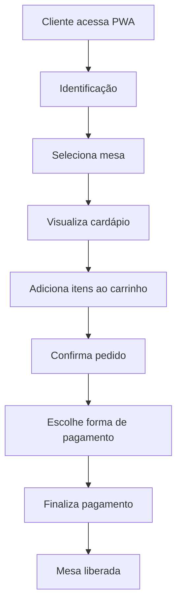
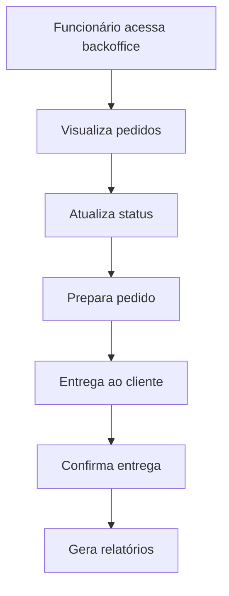
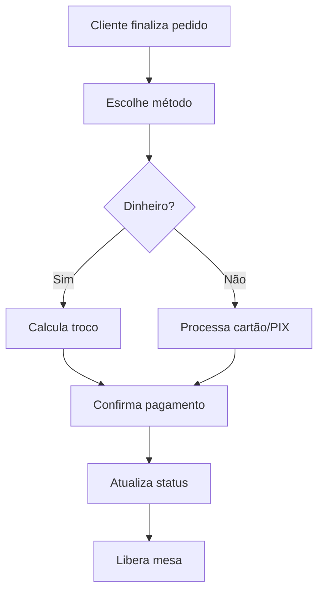

# 📚 Sistema de Comandas Online
## Documentação Completa

---

**Autor:** Pedro Augusto Carvalho  
**Versão:** 1.0.0  
**Data:** 27/07/2024  
**Projeto:** TCC - Sistema de Comandas Online  

---

# 📋 Sumário

1. [Introdução](#introdução)
2. [Visão Geral do Sistema](#visão-geral-do-sistema)
3. [Arquitetura e Tecnologias](#arquitetura-e-tecnologias)
4. [Instalação e Configuração](#instalação-e-configuração)
5. [Estrutura do Projeto](#estrutura-do-projeto)
6. [API Documentation](#api-documentation)
7. [Fluxo de Funcionamento](#fluxo-de-funcionamento)
8. [Funcionalidades](#funcionalidades)
9. [Testes Automatizados](#testes-automatizados)
10. [Deploy e Manutenção](#deploy-e-manutenção)
11. [Documentação Técnica](#documentação-técnica)
12. [FAQ e Suporte](#faq-e-suporte)
13. [Anexos](#anexos)

---

# 🎯 Introdução

## Sobre o Projeto

O **Sistema de Comandas Online** é uma PWA (Progressive Web App) desenvolvida para estabelecimentos gastronômicos, permitindo o gerenciamento completo de pedidos, mesas, clientes e pagamentos.

### Objetivos Principais

- **Automatizar** o processo de pedidos em restaurantes
- **Melhorar** a experiência do cliente
- **Otimizar** o fluxo de trabalho dos funcionários
- **Fornecer** relatórios e análises de vendas
- **Garantir** rastreabilidade completa dos pedidos

### Público-Alvo

- **Restaurantes** e estabelecimentos gastronômicos
- **Bares** e lanchonetes
- **Food trucks** e eventos
- **Cafeterias** e docerias

---

# 🏗️ Visão Geral do Sistema

## Conceito

O sistema é uma aplicação web progressiva (PWA) que permite aos clientes fazerem pedidos diretamente de suas mesas através de dispositivos móveis, enquanto fornece aos estabelecimentos uma ferramenta completa de gestão.

## Características Principais

- **Interface Responsiva**: Funciona em mobile e desktop
- **PWA**: Pode ser instalado como aplicativo
- **Tempo Real**: Atualizações via WebSocket
- **Offline**: Funcionalidades básicas sem internet
- **Multiplataforma**: Acessível via navegador

---

# 🛠️ Arquitetura e Tecnologias

## Diagrama de Arquitetura

```
┌─────────────────┐    ┌─────────────────┐    ┌─────────────────┐
│   Frontend      │    │    Backend      │    │   Database      │
│   (React PWA)   │◄──►│   (Flask API)   │◄──►│   (SQLite)      │
│                 │    │                 │    │                 │
│ • Interface     │    │ • REST API      │    │ • Clientes      │
│ • Navegação     │    │ • WebSocket     │    │ • Pedidos       │
│ • PWA Features  │    │ • Swagger Docs  │    │ • Itens         │
│ • Responsive    │    │ • CORS          │    │ • Pagamentos    │
└─────────────────┘    └─────────────────┘    └─────────────────┘
```

## Stack Tecnológica

### Frontend
- **React 18** - Framework JavaScript
- **Vite** - Build tool e dev server
- **Tailwind CSS** - Framework CSS
- **React Router** - Roteamento
- **Socket.io Client** - Comunicação em tempo real

### Backend
- **Python 3.9+** - Linguagem principal
- **Flask** - Framework web
- **SQLAlchemy** - ORM
- **SQLite** - Banco de dados
- **Flasgger** - Documentação Swagger
- **Flask-SocketIO** - WebSocket

### Ferramentas de Desenvolvimento
- **Git** - Controle de versão
- **GitHub** - Repositório remoto
- **Pytest** - Testes automatizados
- **Cypress** - Testes E2E
- **Jest** - Testes unitários

---

# ⚙️ Instalação e Configuração

## Pré-requisitos

```bash
# Verificar versões
python3 --version  # 3.9+
node --version     # 16+
npm --version      # 8+
```

## Instalação Rápida

```bash
# 1. Clone o repositório
git clone https://github.com/PedroACarvalho/PWA-para-c-lculo-e-pagamento-de-comandas.git
cd "PWA para cálculo e pagamento de comandas"

# 2. Backend
cd backend
python3 -m venv venv
source venv/bin/activate  # Windows: venv\Scripts\activate
pip install -r requirements.txt

# 3. Frontend
cd ..
npm install

# 4. Iniciar
python3 backend/app.py  # Terminal 1
npm run dev            # Terminal 2
```

## Configuração Detalhada

### Backend

```bash
# Criar ambiente virtual
python3 -m venv venv
source venv/bin/activate

# Instalar dependências
pip install -r requirements.txt

# Configurar variáveis de ambiente (opcional)
export FLASK_ENV=development
export FLASK_DEBUG=1

# Inicializar banco de dados
python3 init_db_script.py
```

### Frontend

```bash
# Instalar dependências
npm install

# Configurar variáveis de ambiente (opcional)
echo "VITE_API_URL=http://localhost:5001" > .env

# Verificar instalação
npm run build
```

---

# 📁 Estrutura do Projeto

```
PWA para cálculo e pagamento de comandas/
├── 📁 backend/                    # Backend Python/Flask
│   ├── 📁 models/                 # Modelos do banco
│   │   ├── cliente.py
│   │   ├── item.py
│   │   ├── mesa.py
│   │   ├── pagamento.py
│   │   ├── pedido.py
│   │   └── pedido_item.py
│   ├── 📁 routes/                 # Rotas da API
│   │   ├── auth.py
│   │   ├── menu.py
│   │   ├── orders.py
│   │   ├── payment.py
│   │   └── tables.py
│   ├── 📁 tests/                  # Testes automatizados
│   │   ├── test_auth.py
│   │   ├── test_menu.py
│   │   ├── test_orders.py
│   │   └── test_tables.py
│   ├── app.py                     # Aplicação principal
│   ├── database.py                # Configuração DB
│   └── requirements.txt           # Dependências Python
├── 📁 src/                        # Frontend React
│   ├── 📁 components/             # Componentes reutilizáveis
│   │   ├── Header.jsx
│   │   ├── Sidebar.jsx
│   │   └── ui/                    # Componentes UI
│   ├── 📁 pages/                  # Páginas da aplicação
│   │   ├── Dashboard.jsx
│   │   ├── Menu.jsx
│   │   ├── Orders.jsx
│   │   ├── Tables.jsx
│   │   └── 📁 backoffice/         # Painel administrativo
│   ├── 📁 lib/                    # Utilitários e hooks
│   │   ├── useApi.js
│   │   ├── useSocket.js
│   │   └── utils.js
│   ├── 📁 config/                 # Configurações
│   │   └── api.js
│   └── 📁 __tests__/              # Testes unitários
├── 📁 cypress/                    # Testes E2E
│   └── 📁 e2e/
├── 📁 public/                     # Arquivos estáticos
├── package.json                   # Dependências Node.js
├── vite.config.js                 # Configuração Vite
└── README.md                      # Documentação principal
```

---

# 📚 API Documentation

## Endpoints Principais

### Clientes
```http
POST   /api/cliente              # Criar cliente
GET    /api/cliente/<mesa>       # Buscar por mesa
DELETE /api/cliente/<id>         # Remover cliente
```

### Itens do Menu
```http
GET    /api/itens                # Listar todos
POST   /api/itens                # Criar item
GET    /api/itens/<id>           # Buscar por ID
PUT    /api/itens/<id>           # Atualizar item
DELETE /api/itens/<id>           # Remover item
```

### Pedidos
```http
POST   /api/pedidos              # Criar pedido
GET    /api/pedidos/<id>         # Buscar pedido
PUT    /api/pedidos/<id>/status  # Atualizar status
GET    /api/pedidos/cliente/<id> # Pedidos do cliente
```

### Pagamentos
```http
POST   /api/pagamentos           # Criar pagamento
GET    /api/pagamentos/<id>      # Buscar pagamento
GET    /api/pagamentos/pedido/<id> # Pagamento do pedido
```

## Documentação Interativa

Acesse: `http://localhost:5001/apidocs`

## Exemplos de Uso

### Criar Cliente
```bash
curl -X POST http://localhost:5001/api/cliente \
  -H "Content-Type: application/json" \
  -d '{"nome": "João Silva", "mesa": 1}'
```

### Criar Pedido
```bash
curl -X POST http://localhost:5001/api/pedidos \
  -H "Content-Type: application/json" \
  -d '{
    "cliente_id": 1,
    "itens": [
      {"item_id": 1, "quantidade": 2},
      {"item_id": 3, "quantidade": 1}
    ]
  }'
```

### Fazer Pagamento
```bash
curl -X POST http://localhost:5001/api/pagamentos \
  -H "Content-Type: application/json" \
  -d '{
    "pedido_id": 1,
    "metodo": "Cartão de Crédito",
    "valor": 38.30
  }'
```

---

# 🔄 Fluxo de Funcionamento

## Fluxo do Cliente



## Fluxo do Estabelecimento



## Fluxo de Pagamento



---

# ⚡ Funcionalidades

## Funcionalidades do Cliente

- ✅ **Identificação**: Nome e seleção de mesa
- ✅ **Cardápio Digital**: Visualização de itens e preços
- ✅ **Carrinho Interativo**: Adicionar/remover itens
- ✅ **Pedidos**: Confirmação e acompanhamento
- ✅ **Pagamentos**: Múltiplas formas de pagamento
- ✅ **PWA**: Instalação como app

## Funcionalidades do Estabelecimento

- ✅ **Dashboard**: Visão geral do negócio
- ✅ **Gestão de Pedidos**: Acompanhamento em tempo real
- ✅ **Gestão de Mesas**: Controle de ocupação
- ✅ **Gestão do Cardápio**: CRUD completo de itens
- ✅ **Relatórios**: Análises de vendas
- ✅ **Configurações**: Personalização do sistema

## Funcionalidades Técnicas

- ✅ **API RESTful**: Endpoints bem documentados
- ✅ **WebSocket**: Atualizações em tempo real
- ✅ **Responsive Design**: Funciona em mobile e desktop
- ✅ **PWA Features**: Offline, push notifications
- ✅ **Testes Automatizados**: Cobertura de 70%+
- ✅ **Documentação Swagger**: API interativa

---

# 🧪 Testes Automatizados

## Testes do Backend

```bash
# Executar todos os testes
cd backend
pytest --cov=.

# Executar testes específicos
pytest tests/test_orders.py
pytest tests/test_menu.py

# Ver cobertura detalhada
pytest --cov=. --cov-report=html
```

## Testes do Frontend

```bash
# Testes unitários
npm run test

# Testes com cobertura
npm run test:coverage

# Testes E2E (Cypress)
npx cypress open
npx cypress run
```

## Cobertura de Testes

- **Backend**: ~70% de cobertura
- **Frontend**: Testes unitários + E2E
- **API**: Todos os endpoints testados
- **UI**: Componentes e páginas testados

## Estrutura dos Testes

### Backend (Pytest)
```
backend/tests/
├── conftest.py           # Configuração pytest
├── test_auth.py          # Testes de autenticação
├── test_menu.py          # Testes do menu
├── test_orders.py        # Testes de pedidos
├── test_payments.py      # Testes de pagamentos
├── test_routes.py        # Testes de rotas
└── test_tables.py        # Testes de mesas
```

### Frontend (Vitest + Cypress)
```
src/__tests__/
├── App.test.jsx
├── Badge.test.jsx
├── Button.test.jsx
├── Menu.test.jsx
├── Notification.test.jsx
├── Orders.test.jsx
├── Sidebar.test.jsx
├── Tables.test.jsx
├── useApi.test.jsx
├── useLoading.test.jsx
└── useSocket.test.jsx

cypress/
├── cypress.config.js
├── e2e/
│   └── home.cy.js
└── fixtures/
    └── example.json
```

---

# 🚀 Deploy e Manutenção

## Deploy Local

```bash
# Backend
cd backend
python3 app.py

# Frontend
npm run dev
```

## Deploy em Produção

### Backend (Heroku/Railway)

```bash
# Criar Procfile
echo "web: python app.py" > Procfile

# Configurar variáveis de ambiente
export DATABASE_URL=postgresql://...
export FLASK_ENV=production

# Deploy
git push heroku main
```

### Frontend (Vercel/Netlify)

```bash
# Build para produção
npm run build

# Deploy
vercel --prod
```

## Docker (Opcional)

```dockerfile
# Dockerfile para Backend
FROM python:3.9-slim
WORKDIR /app
COPY requirements.txt .
RUN pip install -r requirements.txt
COPY . .
EXPOSE 5001
CMD ["python", "app.py"]
```

## Monitoramento

- **Logs**: Verificar logs do backend
- **Performance**: Monitorar tempo de resposta
- **Erros**: Acompanhar erros da API
- **Uso**: Métricas de utilização

## Atualizações

```bash
# Atualizar dependências
pip install -r requirements.txt --upgrade
npm update

# Verificar segurança
npm audit
pip-audit

# Testes após atualização
pytest --cov=.
npm run test
```

## Backup

```bash
# Backup do banco
cp comandas.db backup_$(date +%Y%m%d).db

# Backup do código
git push origin main
```

---

# 🔧 Documentação Técnica

## Modelos de Dados

### Schema do Banco

#### Tabela: `clientes`
```sql
CREATE TABLE clientes (
    id INTEGER PRIMARY KEY AUTOINCREMENT,
    nome VARCHAR(100) NOT NULL,
    mesa INTEGER NOT NULL,
    data_criacao TIMESTAMP DEFAULT CURRENT_TIMESTAMP,
    ativo BOOLEAN DEFAULT 1
);
```

#### Tabela: `itens`
```sql
CREATE TABLE itens (
    id INTEGER PRIMARY KEY AUTOINCREMENT,
    nome VARCHAR(100) NOT NULL,
    descricao TEXT,
    preco DECIMAL(10,2) NOT NULL,
    categoria VARCHAR(50) DEFAULT 'Padrão',
    disponivel BOOLEAN DEFAULT 1
);
```

#### Tabela: `pedidos`
```sql
CREATE TABLE pedidos (
    id INTEGER PRIMARY KEY AUTOINCREMENT,
    cliente_id INTEGER NOT NULL,
    status VARCHAR(20) DEFAULT 'Pendente',
    total DECIMAL(10,2) DEFAULT 0,
    data_criacao TIMESTAMP DEFAULT CURRENT_TIMESTAMP,
    data_atualizacao TIMESTAMP DEFAULT CURRENT_TIMESTAMP,
    FOREIGN KEY (cliente_id) REFERENCES clientes(id)
);
```

#### Tabela: `pedido_item`
```sql
CREATE TABLE pedido_item (
    id INTEGER PRIMARY KEY AUTOINCREMENT,
    pedido_id INTEGER NOT NULL,
    item_id INTEGER NOT NULL,
    quantidade INTEGER NOT NULL,
    preco_unitario DECIMAL(10,2) NOT NULL,
    FOREIGN KEY (pedido_id) REFERENCES pedidos(id),
    FOREIGN KEY (item_id) REFERENCES itens(id)
);
```

#### Tabela: `pagamentos`
```sql
CREATE TABLE pagamentos (
    id INTEGER PRIMARY KEY AUTOINCREMENT,
    pedido_id INTEGER NOT NULL,
    metodo VARCHAR(50) NOT NULL,
    valor DECIMAL(10,2) NOT NULL,
    data_pagamento TIMESTAMP DEFAULT CURRENT_TIMESTAMP,
    FOREIGN KEY (pedido_id) REFERENCES pedidos(id)
);
```

## Componentes Frontend

### Estrutura de Componentes
```
src/components/
├── Header.jsx              # Header principal
├── Sidebar.jsx             # Menu lateral
├── MenuItemForm.jsx        # Formulário de itens
├── Layout/
│   └── Layout.jsx          # Layout base
├── PaymentManagement/
│   └── PaymentManagement.jsx # Gestão de pagamentos
└── ui/                     # Componentes UI básicos
    ├── badge.jsx
    ├── button.jsx
    ├── card.jsx
    ├── input.jsx
    ├── label.jsx
    ├── Notification.jsx
    └── textarea.jsx
```

## Hooks Customizados

### useApi Hook
```javascript
// src/lib/useApi.js
import { useState, useEffect } from 'react';

const API_BASE_URL = 'http://localhost:5001/api';

export const useApi = () => {
  const [loading, setLoading] = useState(false);
  const [error, setError] = useState(null);

  const request = async (endpoint, options = {}) => {
    setLoading(true);
    setError(null);
    
    try {
      const response = await fetch(`${API_BASE_URL}${endpoint}`, {
        headers: {
          'Content-Type': 'application/json',
          ...options.headers,
        },
        ...options,
      });
      
      if (!response.ok) {
        throw new Error(`HTTP error! status: ${response.status}`);
      }
      
      const data = await response.json();
      return data;
    } catch (err) {
      setError(err.message);
      throw err;
    } finally {
      setLoading(false);
    }
  };

  return {
    loading,
    error,
    get: (endpoint) => request(endpoint),
    post: (endpoint, data) => request(endpoint, {
      method: 'POST',
      body: JSON.stringify(data),
    }),
    put: (endpoint, data) => request(endpoint, {
      method: 'PUT',
      body: JSON.stringify(data),
    }),
    del: (endpoint) => request(endpoint, { method: 'DELETE' }),
  };
};
```

## Configuração de Ambiente

### Variáveis de Ambiente

#### Backend (.env)
```bash
FLASK_ENV=development
FLASK_DEBUG=1
DATABASE_URL=sqlite:///comandas.db
SECRET_KEY=your-secret-key-here
CORS_ORIGINS=http://localhost:5173,http://127.0.0.1:5173
```

#### Frontend (.env)
```bash
VITE_API_URL=http://localhost:5001
VITE_SOCKET_URL=http://localhost:5001
VITE_APP_NAME=Sistema de Comandas
```

### Dependências

#### requirements.txt
```txt
Flask==2.3.3
Flask-SQLAlchemy==3.0.5
Flask-CORS==4.0.0
Flasgger==0.9.7.1
Flask-SocketIO==5.3.6
python-socketio==5.8.0
python-engineio==4.7.1
pytest==7.4.0
pytest-cov==4.1.0
```

#### package.json
```json
{
  "name": "pwa-comandas",
  "version": "0.0.0",
  "type": "module",
  "scripts": {
    "dev": "vite",
    "build": "vite build",
    "preview": "vite preview",
    "test": "vitest",
    "test:coverage": "vitest --coverage",
    "lint": "eslint . --ext js,jsx --report-unused-disable-directives --max-warnings 0"
  },
  "dependencies": {
    "react": "^18.2.0",
    "react-dom": "^18.2.0",
    "react-router-dom": "^6.8.1",
    "socket.io-client": "^4.6.1",
    "lucide-react": "^0.263.1",
    "clsx": "^2.0.0",
    "tailwind-merge": "^1.14.0"
  }
}
```

---

# ❓ FAQ e Suporte

## Perguntas Frequentes

### Como adicionar novos itens ao cardápio?
1. Acesse o backoffice: `http://localhost:5173/backoffice/menu`
2. Clique em "Adicionar Item"
3. Preencha nome, descrição e preço
4. Salve o item

### Como liberar uma mesa após pagamento?
- A mesa é liberada automaticamente após o pagamento
- O cliente e pedido permanecem no histórico
- Não é possível remover clientes com pedidos ativos

### Como configurar formas de pagamento?
- O sistema suporta: Dinheiro, Cartão de Crédito, Cartão de Débito, PIX
- Para adicionar novas formas, edite o código em `src/pages/Orders.jsx`

### Como gerar relatórios?
1. Acesse: `http://localhost:5173/backoffice/reports`
2. Selecione período desejado
3. Visualize relatórios de vendas

### Como resolver problemas de CORS?
- O backend já está configurado com CORS
- Verifique se ambos os servidores estão rodando
- Confirme as URLs nas configurações

### Como testar o sistema?
```bash
# Backend
pytest --cov=.

# Frontend
npm run test
npm run test:coverage

# E2E
npx cypress run
```

## Problemas Comuns

### Backend não inicia
```bash
# Verificar porta
lsof -ti:5001 | xargs kill -9

# Reinstalar dependências
pip install -r requirements.txt
```

### Frontend não carrega
```bash
# Verificar porta
lsof -ti:5173 | xargs kill -9

# Reinstalar dependências
npm install
```

### Erro de módulo não encontrado
```bash
# Instalar dependências Python
python3 -m pip install flasgger

# Verificar ambiente virtual
source venv/bin/activate
```

## Contato

- **Repositório**: [GitHub](https://github.com/PedroACarvalho/PWA-para-c-lculo-e-pagamento-de-comandas)
- **Issues**: Reporte problemas no GitHub
- **Documentação**: [README.md](./README.md)

---

# 📝 Anexos

## Changelog

### v1.0.0 (2024-07-27)
- ✅ Sistema completo funcional
- ✅ PWA com todas as funcionalidades
- ✅ API RESTful documentada
- ✅ Testes automatizados
- ✅ Interface responsiva
- ✅ Gestão completa de pedidos e pagamentos

## Licença

Este projeto foi desenvolvido como parte de um TCC (Trabalho de Conclusão de Curso).

## Recursos Adicionais

### Links Úteis
- **Documentação Flask**: https://flask.palletsprojects.com/
- **Documentação React**: https://react.dev/
- **Documentação Tailwind**: https://tailwindcss.com/docs
- **Documentação Vite**: https://vitejs.dev/
- **Documentação Pytest**: https://docs.pytest.org/
- **Documentação Vitest**: https://vitest.dev/

### Livros Recomendados
- "Clean Code" - Robert C. Martin
- "Test-Driven Development" - Kent Beck
- "React Design Patterns" - Alex Banks & Eve Porcello
- "Flask Web Development" - Miguel Grinberg

---

**🎉 Sistema 100% Funcional e Documentado!**

*Esta documentação fornece todos os detalhes necessários para entender, instalar, configurar e manter o Sistema de Comandas Online.*

*Última atualização: 27/07/2024*
