# 🔧 Documentação Técnica - Sistema de Comandas Online

## 📋 Índice Técnico

1. [Arquitetura Detalhada](#arquitetura-detalhada)
2. [Modelos de Dados](#modelos-de-dados)
3. [API Endpoints Detalhados](#api-endpoints-detalhados)
4. [Componentes Frontend](#componentes-frontend)
5. [Hooks Customizados](#hooks-customizados)
6. [Configuração de Ambiente](#configuração-de-ambiente)
7. [Testes Técnicos](#testes-técnicos)
8. [Deploy e CI/CD](#deploy-e-cicd)
9. [Troubleshooting](#troubleshooting)
10. [Boas Práticas](#boas-práticas)

---

## 🏗️ Arquitetura Detalhada

### 📊 Diagrama de Componentes

```
┌─────────────────────────────────────────────────────────────┐
│                    Frontend (React PWA)                    │
├─────────────────────────────────────────────────────────────┤
│  ┌─────────────┐  ┌─────────────┐  ┌─────────────┐        │
│  │   Pages     │  │ Components  │  │    Hooks    │        │
│  │             │  │             │  │             │        │
│  │ • Dashboard │  │ • Header    │  │ • useApi    │        │
│  │ • Menu      │  │ • Sidebar   │  │ • useSocket │        │
│  │ • Orders    │  │ • Forms     │  │ • useLoading│        │
│  │ • Tables    │  │ • UI        │  │ • useMenu   │        │
│  └─────────────┘  └─────────────┘  └─────────────┘        │
└─────────────────────────────────────────────────────────────┘
                              │
                              ▼
┌─────────────────────────────────────────────────────────────┐
│                    Backend (Flask API)                     │
├─────────────────────────────────────────────────────────────┤
│  ┌─────────────┐  ┌─────────────┐  ┌─────────────┐        │
│  │   Routes    │  │   Models    │  │   Services  │        │
│  │             │  │             │  │             │        │
│  │ • auth.py   │  │ • cliente.py│  │ • database.py│       │
│  │ • menu.py   │  │ • item.py   │  │ • events.py │        │
│  │ • orders.py │  │ • pedido.py │  │ • utils.py  │        │
│  │ • payment.py│  │ • mesa.py   │  │             │        │
│  │ • tables.py │  │ • pagamento.py│ │             │        │
│  └─────────────┘  └─────────────┘  └─────────────┘        │
└─────────────────────────────────────────────────────────────┘
                              │
                              ▼
┌─────────────────────────────────────────────────────────────┐
│                    Database (SQLite)                       │
├─────────────────────────────────────────────────────────────┤
│  ┌─────────────┐  ┌─────────────┐  ┌─────────────┐        │
│  │   Tables    │  │  Relations  │  │   Indexes   │        │
│  │             │  │             │  │             │        │
│  │ • clientes  │  │ • pedido_item│  │ • idx_mesa │        │
│  │ • itens     │  │ • fk_cliente│  │ • idx_status│        │
│  │ • pedidos   │  │ • fk_item   │  │ • idx_data  │        │
│  │ • mesas     │  │ • fk_pedido │  │             │        │
│  │ • pagamentos│  │             │  │             │        │
│  └─────────────┘  └─────────────┘  └─────────────┘        │
└─────────────────────────────────────────────────────────────┘
```

### 🔄 Fluxo de Comunicação

```mermaid
sequenceDiagram
    participant C as Cliente
    participant F as Frontend
    participant B as Backend
    participant D as Database
    participant W as WebSocket

    C->>F: Acessa PWA
    F->>B: GET /api/itens
    B->>D: SELECT * FROM itens
    D-->>B: Lista de itens
    B-->>F: JSON response
    F-->>C: Renderiza cardápio
    
    C->>F: Adiciona item
    F->>B: POST /api/pedidos
    B->>D: INSERT pedido
    B->>W: Emit 'pedido_novo'
    W-->>F: Atualiza em tempo real
    F-->>C: Confirma pedido
```



---

## 📊 Modelos de Dados

### 🗄️ Schema do Banco

#### Tabela: `clientes`
```sql
CREATE TABLE clientes (
    id INTEGER PRIMARY KEY AUTOINCREMENT,
    nome VARCHAR(100) NOT NULL,
    mesa INTEGER NOT NULL,
    data_criacao TIMESTAMP DEFAULT CURRENT_TIMESTAMP,
    ativo BOOLEAN DEFAULT 1
);
```

#### Tabela: `itens`
```sql
CREATE TABLE itens (
    id INTEGER PRIMARY KEY AUTOINCREMENT,
    nome VARCHAR(100) NOT NULL,
    descricao TEXT,
    preco DECIMAL(10,2) NOT NULL,
    categoria VARCHAR(50) DEFAULT 'Padrão',
    disponivel BOOLEAN DEFAULT 1
);
```

#### Tabela: `pedidos`
```sql
CREATE TABLE pedidos (
    id INTEGER PRIMARY KEY AUTOINCREMENT,
    cliente_id INTEGER NOT NULL,
    status VARCHAR(20) DEFAULT 'Pendente',
    total DECIMAL(10,2) DEFAULT 0,
    data_criacao TIMESTAMP DEFAULT CURRENT_TIMESTAMP,
    data_atualizacao TIMESTAMP DEFAULT CURRENT_TIMESTAMP,
    FOREIGN KEY (cliente_id) REFERENCES clientes(id)
);
```

#### Tabela: `pedido_item`
```sql
CREATE TABLE pedido_item (
    id INTEGER PRIMARY KEY AUTOINCREMENT,
    pedido_id INTEGER NOT NULL,
    item_id INTEGER NOT NULL,
    quantidade INTEGER NOT NULL,
    preco_unitario DECIMAL(10,2) NOT NULL,
    FOREIGN KEY (pedido_id) REFERENCES pedidos(id),
    FOREIGN KEY (item_id) REFERENCES itens(id)
);
```

#### Tabela: `pagamentos`
```sql
CREATE TABLE pagamentos (
    id INTEGER PRIMARY KEY AUTOINCREMENT,
    pedido_id INTEGER NOT NULL,
    metodo VARCHAR(50) NOT NULL,
    valor DECIMAL(10,2) NOT NULL,
    data_pagamento TIMESTAMP DEFAULT CURRENT_TIMESTAMP,
    FOREIGN KEY (pedido_id) REFERENCES pedidos(id)
);
```

### 🐍 Modelos Python (SQLAlchemy)

#### Cliente Model
```python
class Cliente(db.Model):
    __tablename__ = 'clientes'
    
    id = db.Column(db.Integer, primary_key=True)
    nome = db.Column(db.String(100), nullable=False)
    mesa = db.Column(db.Integer, nullable=False)
    data_criacao = db.Column(db.DateTime, default=datetime.utcnow)
    ativo = db.Column(db.Boolean, default=True)
    
    # Relacionamentos
    pedidos = db.relationship('Pedido', backref='cliente', lazy=True)
    
    def to_dict(self):
        return {
            'id': self.id,
            'nome': self.nome,
            'mesa': self.mesa,
            'data_criacao': self.data_criacao.isoformat(),
            'ativo': self.ativo
        }
```

#### Pedido Model
```python
class Pedido(db.Model):
    __tablename__ = 'pedidos'
    
    id = db.Column(db.Integer, primary_key=True)
    cliente_id = db.Column(db.Integer, db.ForeignKey('clientes.id'), nullable=False)
    status = db.Column(db.String(20), default='Pendente')
    total = db.Column(db.Decimal(10, 2), default=0)
    data_criacao = db.Column(db.DateTime, default=datetime.utcnow)
    data_atualizacao = db.Column(db.DateTime, default=datetime.utcnow, onupdate=datetime.utcnow)
    
    # Relacionamentos
    itens = db.relationship('PedidoItem', backref='pedido', lazy=True)
    pagamento = db.relationship('Pagamento', backref='pedido', uselist=False)
    
    def calcular_total(self):
        return sum(item.preco_unitario * item.quantidade for item in self.itens)
```

---

## 🔗 API Endpoints Detalhados

### 📋 Especificação Completa

#### Clientes

```http
POST /api/cliente
Content-Type: application/json

{
    "nome": "string (required)",
    "mesa": "integer (required)"
}

Response: 201 Created
{
    "id": 1,
    "nome": "João Silva",
    "mesa": 1,
    "data_criacao": "2024-07-27T22:00:00",
    "ativo": true
}
```

```http
GET /api/cliente/<mesa>
Response: 200 OK
{
    "id": 1,
    "nome": "João Silva",
    "mesa": 1,
    "pedidos": [...]
}
```

#### Itens do Menu

```http
GET /api/itens
Query Parameters:
- categoria: string (optional)
- disponivel: boolean (optional)

Response: 200 OK
{
    "itens": [
        {
            "id": 1,
            "nome": "X-Burger",
            "descricao": "Hambúrguer com queijo",
            "preco": 15.90,
            "categoria": "Padrão",
            "disponivel": true
        }
    ]
}
```

```http
POST /api/itens
Content-Type: application/json

{
    "nome": "string (required)",
    "descricao": "string (optional)",
    "preco": "decimal (required)",
    "categoria": "string (optional)"
}
```

#### Pedidos

```http
POST /api/pedidos
Content-Type: application/json

{
    "cliente_id": "integer (required)",
    "itens": [
        {
            "item_id": "integer (required)",
            "quantidade": "integer (required)"
        }
    ]
}

Response: 201 Created
{
    "id": 1,
    "cliente_id": 1,
    "status": "Pendente",
    "total": 38.30,
    "itens": [...],
    "data_criacao": "2024-07-27T22:00:00"
}
```

```http
PUT /api/pedidos/<id>/status
Content-Type: application/json

{
    "status": "string (required) - ['Pendente', 'Em Preparo', 'Pronto', 'Entregue', 'Cancelado']"
}
```

#### Pagamentos

```http
POST /api/pagamentos
Content-Type: application/json

{
    "pedido_id": "integer (required)",
    "metodo": "string (required) - ['Dinheiro', 'Cartão de Crédito', 'Cartão de Débito', 'PIX']",
    "valor": "decimal (required)"
}
```

### 🔍 Códigos de Status HTTP

- `200 OK` - Requisição bem-sucedida
- `201 Created` - Recurso criado com sucesso
- `400 Bad Request` - Dados inválidos
- `404 Not Found` - Recurso não encontrado
- `409 Conflict` - Conflito (ex: mesa ocupada)
- `500 Internal Server Error` - Erro interno

---

## ⚛️ Componentes Frontend

### 🧩 Estrutura de Componentes

```
src/components/
├── Header.jsx              # Header principal
├── Sidebar.jsx             # Menu lateral
├── MenuItemForm.jsx        # Formulário de itens
├── Layout/
│   └── Layout.jsx          # Layout base
├── PaymentManagement/
│   └── PaymentManagement.jsx # Gestão de pagamentos
└── ui/                     # Componentes UI básicos
    ├── badge.jsx
    ├── button.jsx
    ├── card.jsx
    ├── input.jsx
    ├── label.jsx
    ├── Notification.jsx
    └── textarea.jsx
```

### 🔧 Componente Exemplo: MenuItemForm

```jsx
import React, { useState } from 'react';
import { useMenuItems } from '../lib/useMenuItems';

const MenuItemForm = ({ item = null, onSave, onCancel }) => {
  const [formData, setFormData] = useState({
    nome: item?.nome || '',
    descricao: item?.descricao || '',
    preco: item?.preco || '',
    categoria: item?.categoria || 'Padrão'
  });
  
  const { createItem, updateItem, loading } = useMenuItems();
  
  const handleSubmit = async (e) => {
    e.preventDefault();
    
    try {
      if (item) {
        await updateItem(item.id, formData);
      } else {
        await createItem(formData);
      }
      onSave();
    } catch (error) {
      console.error('Erro ao salvar item:', error);
    }
  };
  
  return (
    <form onSubmit={handleSubmit} className="space-y-4">
      <div>
        <label className="block text-sm font-medium text-gray-700">
          Nome
        </label>
        <input
          type="text"
          value={formData.nome}
          onChange={(e) => setFormData({...formData, nome: e.target.value})}
          className="mt-1 block w-full rounded-md border-gray-300 shadow-sm"
          required
        />
      </div>
      
      <div>
        <label className="block text-sm font-medium text-gray-700">
          Descrição
        </label>
        <textarea
          value={formData.descricao}
          onChange={(e) => setFormData({...formData, descricao: e.target.value})}
          className="mt-1 block w-full rounded-md border-gray-300 shadow-sm"
          rows={3}
        />
      </div>
      
      <div>
        <label className="block text-sm font-medium text-gray-700">
          Preço
        </label>
        <input
          type="number"
          step="0.01"
          value={formData.preco}
          onChange={(e) => setFormData({...formData, preco: e.target.value})}
          className="mt-1 block w-full rounded-md border-gray-300 shadow-sm"
          required
        />
      </div>
      
      <div className="flex justify-end space-x-3">
        <button
          type="button"
          onClick={onCancel}
          className="px-4 py-2 border border-gray-300 rounded-md text-gray-700 hover:bg-gray-50"
        >
          Cancelar
        </button>
        <button
          type="submit"
          disabled={loading}
          className="px-4 py-2 bg-blue-600 text-white rounded-md hover:bg-blue-700 disabled:opacity-50"
        >
          {loading ? 'Salvando...' : (item ? 'Atualizar' : 'Criar')}
        </button>
      </div>
    </form>
  );
};

export default MenuItemForm;
```

---

## 🎣 Hooks Customizados

### 🔧 useApi Hook

```javascript
// src/lib/useApi.js
import { useState, useEffect } from 'react';

const API_BASE_URL = 'http://localhost:5001/api';

export const useApi = () => {
  const [loading, setLoading] = useState(false);
  const [error, setError] = useState(null);

  const request = async (endpoint, options = {}) => {
    setLoading(true);
    setError(null);
    
    try {
      const response = await fetch(`${API_BASE_URL}${endpoint}`, {
        headers: {
          'Content-Type': 'application/json',
          ...options.headers,
        },
        ...options,
      });
      
      if (!response.ok) {
        throw new Error(`HTTP error! status: ${response.status}`);
      }
      
      const data = await response.json();
      return data;
    } catch (err) {
      setError(err.message);
      throw err;
    } finally {
      setLoading(false);
    }
  };

  return {
    loading,
    error,
    get: (endpoint) => request(endpoint),
    post: (endpoint, data) => request(endpoint, {
      method: 'POST',
      body: JSON.stringify(data),
    }),
    put: (endpoint, data) => request(endpoint, {
      method: 'PUT',
      body: JSON.stringify(data),
    }),
    del: (endpoint) => request(endpoint, { method: 'DELETE' }),
  };
};
```

### 🔧 useSocket Hook

```javascript
// src/lib/useSocket.js
import { useEffect, useRef } from 'react';
import io from 'socket.io-client';

export const useSocket = () => {
  const socketRef = useRef(null);

  useEffect(() => {
    socketRef.current = io('http://localhost:5001');
    
    return () => {
      if (socketRef.current) {
        socketRef.current.disconnect();
      }
    };
  }, []);

  const emit = (event, data) => {
    if (socketRef.current) {
      socketRef.current.emit(event, data);
    }
  };

  const on = (event, callback) => {
    if (socketRef.current) {
      socketRef.current.on(event, callback);
    }
  };

  return { emit, on };
};
```

### 🔧 useMenuItems Hook

```javascript
// src/lib/useMenuItems.js
import { useState, useEffect } from 'react';
import { useApi } from './useApi';

export const useMenuItems = () => {
  const [items, setItems] = useState([]);
  const [loading, setLoading] = useState(false);
  const { get, post, put, del } = useApi();

  const fetchItems = async () => {
    setLoading(true);
    try {
      const data = await get('/itens');
      setItems(data.itens || []);
    } catch (error) {
      console.error('Erro ao buscar itens:', error);
    } finally {
      setLoading(false);
    }
  };

  const createItem = async (itemData) => {
    try {
      const newItem = await post('/itens', itemData);
      setItems(prev => [...prev, newItem]);
      return newItem;
    } catch (error) {
      throw error;
    }
  };

  const updateItem = async (id, itemData) => {
    try {
      const updatedItem = await put(`/itens/${id}`, itemData);
      setItems(prev => prev.map(item => 
        item.id === id ? updatedItem : item
      ));
      return updatedItem;
    } catch (error) {
      throw error;
    }
  };

  const deleteItem = async (id) => {
    try {
      await del(`/itens/${id}`);
      setItems(prev => prev.filter(item => item.id !== id));
    } catch (error) {
      throw error;
    }
  };

  useEffect(() => {
    fetchItems();
  }, []);

  return {
    items,
    loading,
    createItem,
    updateItem,
    deleteItem,
    fetchItems,
  };
};
```

---

## ⚙️ Configuração de Ambiente

### 🔧 Variáveis de Ambiente

#### Backend (.env)
```bash
FLASK_ENV=development
FLASK_DEBUG=1
DATABASE_URL=sqlite:///comandas.db
SECRET_KEY=your-secret-key-here
CORS_ORIGINS=http://localhost:5173,http://127.0.0.1:5173
```

#### Frontend (.env)
```bash
VITE_API_URL=http://localhost:5001
VITE_SOCKET_URL=http://localhost:5001
VITE_APP_NAME=Sistema de Comandas
```

### 🐍 Configuração Python

#### requirements.txt
```txt
Flask==2.3.3
Flask-SQLAlchemy==3.0.5
Flask-CORS==4.0.0
Flasgger==0.9.7.1
Flask-SocketIO==5.3.6
python-socketio==5.8.0
python-engineio==4.7.1
pytest==7.4.0
pytest-cov==4.1.0
```

#### app.py Configuration
```python
from flask import Flask
from flask_cors import CORS
from flask_socketio import SocketIO
from flasgger import Swagger

app = Flask(__name__)
app.config['SECRET_KEY'] = 'your-secret-key'
app.config['SQLALCHEMY_DATABASE_URI'] = 'sqlite:///comandas.db'
app.config['SQLALCHEMY_TRACK_MODIFICATIONS'] = False

# CORS Configuration
CORS(app, origins=['http://localhost:5173'])

# SocketIO Configuration
socketio = SocketIO(app, cors_allowed_origins="*")

# Swagger Configuration
swagger_config = {
    "headers": [],
    "specs": [
        {
            "endpoint": 'apidocs',
            "route": '/apidocs.json',
            "rule_filter": lambda rule: True,
            "model_filter": lambda tag: True,
        }
    ],
    "static_url_path": "/flasgger_static",
    "swagger_ui": True,
    "specs_route": "/apidocs"
}

swagger_template = {
    "swagger": "2.0",
    "info": {
        "title": "Sistema de Comandas API",
        "description": "API para gerenciamento de comandas",
        "version": "1.0.0"
    }
}

Swagger(app, config=swagger_config, template=swagger_template)
```

### 📦 Configuração Node.js

#### package.json
```json
{
  "name": "pwa-comandas",
  "version": "0.0.0",
  "type": "module",
  "scripts": {
    "dev": "vite",
    "build": "vite build",
    "preview": "vite preview",
    "test": "vitest",
    "test:coverage": "vitest --coverage",
    "lint": "eslint . --ext js,jsx --report-unused-disable-directives --max-warnings 0"
  },
  "dependencies": {
    "react": "^18.2.0",
    "react-dom": "^18.2.0",
    "react-router-dom": "^6.8.1",
    "socket.io-client": "^4.6.1",
    "lucide-react": "^0.263.1",
    "clsx": "^2.0.0",
    "tailwind-merge": "^1.14.0"
  },
  "devDependencies": {
    "@types/react": "^18.2.15",
    "@types/react-dom": "^18.2.7",
    "@vitejs/plugin-react": "^4.0.3",
    "autoprefixer": "^10.4.14",
    "eslint": "^8.45.0",
    "eslint-plugin-react": "^7.32.2",
    "eslint-plugin-react-hooks": "^4.6.0",
    "eslint-plugin-react-refresh": "^0.4.3",
    "postcss": "^8.4.27",
    "tailwindcss": "^3.3.3",
    "vite": "^4.4.5",
    "vitest": "^0.34.4",
    "@testing-library/react": "^13.4.0",
    "@testing-library/jest-dom": "^5.16.5",
    "jsdom": "^22.1.0"
  }
}
```

---

## 🧪 Testes Técnicos

### 🐍 Testes Backend (Pytest)

#### Estrutura de Testes
```
backend/tests/
├── conftest.py           # Configuração pytest
├── test_auth.py          # Testes de autenticação
├── test_menu.py          # Testes do menu
├── test_orders.py        # Testes de pedidos
├── test_payments.py      # Testes de pagamentos
├── test_routes.py        # Testes de rotas
└── test_tables.py        # Testes de mesas
```

#### Exemplo de Teste
```python
# backend/tests/test_orders.py
import pytest
from backend.app import app, db
from backend.models.pedido import Pedido
from backend.models.cliente import Cliente
from backend.models.item import Item

@pytest.fixture
def client():
    app.config['TESTING'] = True
    app.config['SQLALCHEMY_DATABASE_URI'] = 'sqlite:///:memory:'
    
    with app.test_client() as client:
        with app.app_context():
            db.create_all()
            yield client
            db.drop_all()

def test_criar_pedido(client):
    # Arrange
    cliente_data = {"nome": "João", "mesa": 1}
    cliente_response = client.post('/api/cliente', json=cliente_data)
    cliente_id = cliente_response.json['id']
    
    item_data = {"nome": "X-Burger", "preco": 15.90}
    item_response = client.post('/api/itens', json=item_data)
    item_id = item_response.json['id']
    
    pedido_data = {
        "cliente_id": cliente_id,
        "itens": [{"item_id": item_id, "quantidade": 2}]
    }
    
    # Act
    response = client.post('/api/pedidos', json=pedido_data)
    
    # Assert
    assert response.status_code == 201
    assert response.json['cliente_id'] == cliente_id
    assert response.json['status'] == 'Pendente'
    assert float(response.json['total']) == 31.80
```

### ⚛️ Testes Frontend (Vitest)

#### Estrutura de Testes
```
src/__tests__/
├── App.test.jsx
├── Badge.test.jsx
├── Button.test.jsx
├── Menu.test.jsx
├── Notification.test.jsx
├── Orders.test.jsx
├── Sidebar.test.jsx
├── Tables.test.jsx
├── useApi.test.jsx
├── useLoading.test.jsx
└── useSocket.test.jsx
```

#### Exemplo de Teste
```javascript
// src/__tests__/Menu.test.jsx
import { render, screen, fireEvent, waitFor } from '@testing-library/react';
import { describe, it, expect, vi } from 'vitest';
import Menu from '../pages/Menu';

// Mock do hook useMenuItems
vi.mock('../lib/useMenuItems', () => ({
  useMenuItems: () => ({
    items: [
      { id: 1, nome: 'X-Burger', preco: 15.90, descricao: 'Hambúrguer' },
      { id: 2, nome: 'X-Salada', preco: 17.90, descricao: 'Salada' }
    ],
    loading: false,
    createItem: vi.fn(),
    updateItem: vi.fn(),
    deleteItem: vi.fn()
  })
}));

describe('Menu Component', () => {
  it('renderiza lista de itens do cardápio', () => {
    render(<Menu />);
    
    expect(screen.getByText('X-Burger')).toBeInTheDocument();
    expect(screen.getByText('X-Salada')).toBeInTheDocument();
    expect(screen.getByText('R$ 15,90')).toBeInTheDocument();
    expect(screen.getByText('R$ 17,90')).toBeInTheDocument();
  });

  it('permite adicionar novo item', async () => {
    render(<Menu />);
    
    const addButton = screen.getByText('Adicionar Item');
    fireEvent.click(addButton);
    
    await waitFor(() => {
      expect(screen.getByText('Novo Item')).toBeInTheDocument();
    });
  });
});
```

### 🌐 Testes E2E (Cypress)

#### Estrutura de Testes
```
cypress/
├── cypress.config.js
├── e2e/
│   └── home.cy.js
└── fixtures/
    └── example.json
```

#### Exemplo de Teste E2E
```javascript
// cypress/e2e/home.cy.js
describe('Página Inicial', () => {
  beforeEach(() => {
    cy.visit('http://localhost:5173');
  });

  it('deve exibir o título do sistema', () => {
    cy.contains(/comanda|dashboard|cardápio|mesa|pedido/i).should('exist');
  });

  it('deve permitir navegação para o cardápio', () => {
    cy.get('[data-testid="menu-link"]').click();
    cy.url().should('include', '/menu');
  });

  it('deve permitir adicionar item ao carrinho', () => {
    cy.visit('http://localhost:5173/menu');
    cy.get('[data-testid="add-to-cart"]').first().click();
    cy.get('[data-testid="cart-count"]').should('contain', '1');
  });
});
```

---

## 🚀 Deploy e CI/CD

### 🐳 Docker Configuration

#### Dockerfile Backend
```dockerfile
FROM python:3.9-slim

WORKDIR /app

COPY requirements.txt .
RUN pip install --no-cache-dir -r requirements.txt

COPY . .

EXPOSE 5001

CMD ["python", "app.py"]
```

#### Dockerfile Frontend
```dockerfile
FROM node:16-alpine

WORKDIR /app

COPY package*.json ./
RUN npm ci --only=production

COPY . .
RUN npm run build

FROM nginx:alpine
COPY --from=0 /app/dist /usr/share/nginx/html
COPY nginx.conf /etc/nginx/nginx.conf

EXPOSE 80

CMD ["nginx", "-g", "daemon off;"]
```

#### docker-compose.yml
```yaml
version: '3.8'

services:
  backend:
    build: ./backend
    ports:
      - "5001:5001"
    environment:
      - FLASK_ENV=production
      - DATABASE_URL=sqlite:///comandas.db
    volumes:
      - ./backend:/app
      - ./data:/app/data

  frontend:
    build: .
    ports:
      - "80:80"
    depends_on:
      - backend
    environment:
      - VITE_API_URL=http://localhost:5001
```

### 🔄 GitHub Actions

#### .github/workflows/ci.yml
```yaml
name: CI/CD Pipeline

on:
  push:
    branches: [ main ]
  pull_request:
    branches: [ main ]

jobs:
  test-backend:
    runs-on: ubuntu-latest
    
    steps:
    - uses: actions/checkout@v3
    
    - name: Set up Python
      uses: actions/setup-python@v4
      with:
        python-version: '3.9'
    
    - name: Install dependencies
      run: |
        cd backend
        pip install -r requirements.txt
    
    - name: Run tests
      run: |
        cd backend
        pytest --cov=. --cov-report=xml
    
    - name: Upload coverage
      uses: codecov/codecov-action@v3
      with:
        file: ./backend/coverage.xml

  test-frontend:
    runs-on: ubuntu-latest
    
    steps:
    - uses: actions/checkout@v3
    
    - name: Set up Node.js
      uses: actions/setup-node@v3
      with:
        node-version: '16'
        cache: 'npm'
    
    - name: Install dependencies
      run: npm ci
    
    - name: Run tests
      run: npm run test:coverage
    
    - name: Build
      run: npm run build

  deploy:
    needs: [test-backend, test-frontend]
    runs-on: ubuntu-latest
    if: github.ref == 'refs/heads/main'
    
    steps:
    - uses: actions/checkout@v3
    
    - name: Deploy to production
      run: |
        echo "Deploy to production server"
        # Add your deployment commands here
```

---

## 🔧 Troubleshooting

### 🐛 Problemas Comuns

#### Backend não inicia
```bash
# Erro: ModuleNotFoundError: No module named 'flasgger'
python3 -m pip install flasgger

# Erro: Port already in use
lsof -ti:5001 | xargs kill -9

# Erro: Database locked
rm -f comandas.db
python3 init_db_script.py
```

#### Frontend não carrega
```bash
# Erro: Port already in use
lsof -ti:5173 | xargs kill -9

# Erro: Module not found
rm -rf node_modules package-lock.json
npm install

# Erro: Build failed
npm run build --verbose
```

#### Problemas de CORS
```python
# backend/app.py
from flask_cors import CORS

app = Flask(__name__)
CORS(app, origins=['http://localhost:5173', 'http://127.0.0.1:5173'])
```

#### Problemas de WebSocket
```javascript
// src/lib/useSocket.js
const socket = io('http://localhost:5001', {
  transports: ['websocket', 'polling'],
  timeout: 20000
});
```

### 🔍 Debugging

#### Logs do Backend
```python
import logging

logging.basicConfig(level=logging.DEBUG)
logger = logging.getLogger(__name__)

@app.route('/api/test')
def test():
    logger.debug('Test endpoint called')
    return {'message': 'OK'}
```

#### Logs do Frontend
```javascript
// src/lib/useApi.js
const request = async (endpoint, options = {}) => {
  console.log('API Request:', endpoint, options);
  
  try {
    const response = await fetch(`${API_BASE_URL}${endpoint}`, options);
    console.log('API Response:', response.status, response.statusText);
    
    const data = await response.json();
    console.log('API Data:', data);
    
    return data;
  } catch (error) {
    console.error('API Error:', error);
    throw error;
  }
};
```

---

## 📋 Boas Práticas

### 🐍 Python (Backend)

#### Estrutura de Código
```python
# ✅ Bom
class PedidoService:
    def __init__(self, db):
        self.db = db
    
    def criar_pedido(self, cliente_id, itens):
        try:
            pedido = Pedido(cliente_id=cliente_id)
            self.db.session.add(pedido)
            self.db.session.commit()
            return pedido
        except Exception as e:
            self.db.session.rollback()
            raise e

# ❌ Evitar
def criar_pedido(cliente_id, itens):
    pedido = Pedido(cliente_id=cliente_id)
    db.session.add(pedido)
    db.session.commit()
    return pedido
```

#### Tratamento de Erros
```python
from flask import jsonify

@app.errorhandler(404)
def not_found(error):
    return jsonify({'error': 'Recurso não encontrado'}), 404

@app.errorhandler(500)
def internal_error(error):
    return jsonify({'error': 'Erro interno do servidor'}), 500
```

### ⚛️ React (Frontend)

#### Componentes Funcionais
```jsx
// ✅ Bom
const MenuItem = ({ item, onAddToCart }) => {
  const handleClick = () => {
    onAddToCart(item);
  };

  return (
    <div className="menu-item">
      <h3>{item.nome}</h3>
      <p>{item.descricao}</p>
      <span>R$ {item.preco}</span>
      <button onClick={handleClick}>Adicionar</button>
    </div>
  );
};

// ❌ Evitar
const MenuItem = ({ item, onAddToCart }) => {
  return (
    <div className="menu-item">
      <h3>{item.nome}</h3>
      <p>{item.descricao}</p>
      <span>R$ {item.preco}</span>
      <button onClick={() => onAddToCart(item)}>Adicionar</button>
    </div>
  );
};
```

#### Hooks Customizados
```jsx
// ✅ Bom
const useLocalStorage = (key, initialValue) => {
  const [storedValue, setStoredValue] = useState(() => {
    try {
      const item = window.localStorage.getItem(key);
      return item ? JSON.parse(item) : initialValue;
    } catch (error) {
      console.error(error);
      return initialValue;
    }
  });

  const setValue = (value) => {
    try {
      setStoredValue(value);
      window.localStorage.setItem(key, JSON.stringify(value));
    } catch (error) {
      console.error(error);
    }
  };

  return [storedValue, setValue];
};
```

### 🧪 Testes

#### Testes Unitários
```python
# ✅ Bom
def test_criar_pedido_com_itens():
    # Arrange
    cliente = Cliente(nome="João", mesa=1)
    item = Item(nome="X-Burger", preco=15.90)
    db.session.add_all([cliente, item])
    db.session.commit()
    
    # Act
    pedido = Pedido(cliente_id=cliente.id)
    pedido_item = PedidoItem(
        pedido_id=pedido.id,
        item_id=item.id,
        quantidade=2,
        preco_unitario=item.preco
    )
    db.session.add_all([pedido, pedido_item])
    db.session.commit()
    
    # Assert
    assert pedido.total == 31.80
    assert len(pedido.itens) == 1
```

#### Testes de Integração
```javascript
// ✅ Bom
describe('Menu Integration', () => {
  it('deve permitir adicionar item ao carrinho', async () => {
    render(<Menu />);
    
    const addButton = screen.getByText('Adicionar ao Carrinho');
    fireEvent.click(addButton);
    
    await waitFor(() => {
      expect(screen.getByText('Item adicionado!')).toBeInTheDocument();
    });
  });
});
```

---

## 📚 Recursos Adicionais

### 🔗 Links Úteis

- **Documentação Flask**: https://flask.palletsprojects.com/
- **Documentação React**: https://react.dev/
- **Documentação Tailwind**: https://tailwindcss.com/docs
- **Documentação Vite**: https://vitejs.dev/
- **Documentação Pytest**: https://docs.pytest.org/
- **Documentação Vitest**: https://vitest.dev/

### 📖 Livros Recomendados

- "Clean Code" - Robert C. Martin
- "Test-Driven Development" - Kent Beck
- "React Design Patterns" - Alex Banks & Eve Porcello
- "Flask Web Development" - Miguel Grinberg

---

**🎯 Documentação Técnica Completa!**

*Esta documentação fornece todos os detalhes técnicos necessários para desenvolvedores trabalharem no projeto.*

*Última atualização: 27/07/2024* 