# 📚 Wiki - Sistema de Comandas Online

## 📋 Índice

1. [Visão Geral](#visão-geral)
2. [Arquitetura do Sistema](#arquitetura-do-sistema)
3. [Tecnologias Utilizadas](#tecnologias-utilizadas)
4. [Instalação e Configuração](#instalação-e-configuração)
5. [Estrutura do Projeto](#estrutura-do-projeto)
6. [API Documentation](#api-documentation)
7. [Fluxo de Funcionamento](#fluxo-de-funcionamento)
8. [Funcionalidades](#funcionalidades)
9. [Testes](#testes)
10. [Deploy](#deploy)
11. [Manutenção](#manutenção)
12. [FAQ](#faq)

---

## 🎯 Visão Geral

O **Sistema de Comandas Online** é uma PWA (Progressive Web App) desenvolvida para estabelecimentos gastronômicos, permitindo o gerenciamento completo de pedidos, mesas, clientes e pagamentos.

### 🎯 Objetivos

- **Automatizar** o processo de pedidos em restaurantes
- **Melhorar** a experiência do cliente
- **Otimizar** o fluxo de trabalho dos funcionários
- **Fornecer** relatórios e análises de vendas
- **Garantir** rastreabilidade completa dos pedidos

### 🎯 Público-Alvo

- **Restaurantes** e estabelecimentos gastronômicos
- **Bares** e lanchonetes
- **Food trucks** e eventos
- **Cafeterias** e docerias

---

## 🏗️ Arquitetura do Sistema

### 📊 Diagrama de Arquitetura

```
┌─────────────────┐    ┌─────────────────┐    ┌─────────────────┐
│   Frontend      │    │    Backend      │    │   Database      │
│   (React PWA)   │◄──►│   (Flask API)   │◄──►│   (SQLite)      │
│                 │    │                 │    │                 │
│ • Interface     │    │ • REST API      │    │ • Clientes      │
│ • Navegação     │    │ • WebSocket     │    │ • Pedidos       │
│ • PWA Features  │    │ • Swagger Docs  │    │ • Itens         │
│ • Responsive    │    │ • CORS          │    │ • Pagamentos    │
└─────────────────┘    └─────────────────┘    └─────────────────┘
```

### 🔄 Fluxo de Dados

1. **Cliente** acessa a PWA
2. **Frontend** faz requisições para API
3. **Backend** processa e valida dados
4. **Database** armazena informações
5. **WebSocket** notifica atualizações em tempo real

---

## 🛠️ Tecnologias Utilizadas

### Frontend
- **React 18** - Framework JavaScript
- **Vite** - Build tool e dev server
- **Tailwind CSS** - Framework CSS
- **React Router** - Roteamento
- **Socket.io Client** - Comunicação em tempo real

### Backend
- **Python 3.9+** - Linguagem principal
- **Flask** - Framework web
- **SQLAlchemy** - ORM
- **SQLite** - Banco de dados
- **Flasgger** - Documentação Swagger
- **Flask-SocketIO** - WebSocket

### Ferramentas de Desenvolvimento
- **Git** - Controle de versão
- **GitHub** - Repositório remoto
- **Pytest** - Testes automatizados
- **Cypress** - Testes E2E
- **Jest** - Testes unitários

---

## ⚙️ Instalação e Configuração

### 📋 Pré-requisitos

```bash
# Verificar versões
python3 --version  # 3.9+
node --version     # 16+
npm --version      # 8+
```

### 🚀 Instalação Rápida

```bash
# 1. Clone o repositório
git clone https://github.com/PedroACarvalho/PWA-para-c-lculo-e-pagamento-de-comandas.git
cd "PWA para cálculo e pagamento de comandas"

# 2. Backend
cd backend
python3 -m venv venv
source venv/bin/activate  # Windows: venv\Scripts\activate
pip install -r requirements.txt

# 3. Frontend
cd ..
npm install

# 4. Iniciar
python3 backend/app.py  # Terminal 1
npm run dev            # Terminal 2
```

### 🔧 Configuração Detalhada

#### Backend

```bash
# Criar ambiente virtual
python3 -m venv venv
source venv/bin/activate

# Instalar dependências
pip install -r requirements.txt

# Configurar variáveis de ambiente (opcional)
export FLASK_ENV=development
export FLASK_DEBUG=1

# Inicializar banco de dados
python3 init_db_script.py
```

#### Frontend

```bash
# Instalar dependências
npm install

# Configurar variáveis de ambiente (opcional)
echo "VITE_API_URL=http://localhost:5001" > .env

# Verificar instalação
npm run build
```

---

## 📁 Estrutura do Projeto

```
PWA para cálculo e pagamento de comandas/
├── 📁 backend/                    # Backend Python/Flask
│   ├── 📁 models/                 # Modelos do banco
│   │   ├── cliente.py
│   │   ├── item.py
│   │   ├── mesa.py
│   │   ├── pagamento.py
│   │   ├── pedido.py
│   │   └── pedido_item.py
│   ├── 📁 routes/                 # Rotas da API
│   │   ├── auth.py
│   │   ├── menu.py
│   │   ├── orders.py
│   │   ├── payment.py
│   │   └── tables.py
│   ├── 📁 tests/                  # Testes automatizados
│   │   ├── test_auth.py
│   │   ├── test_menu.py
│   │   ├── test_orders.py
│   │   └── test_tables.py
│   ├── app.py                     # Aplicação principal
│   ├── database.py                # Configuração DB
│   └── requirements.txt           # Dependências Python
├── 📁 src/                        # Frontend React
│   ├── 📁 components/             # Componentes reutilizáveis
│   │   ├── Header.jsx
│   │   ├── Sidebar.jsx
│   │   └── ui/                    # Componentes UI
│   ├── 📁 pages/                  # Páginas da aplicação
│   │   ├── Dashboard.jsx
│   │   ├── Menu.jsx
│   │   ├── Orders.jsx
│   │   ├── Tables.jsx
│   │   └── 📁 backoffice/         # Painel administrativo
│   ├── 📁 lib/                    # Utilitários e hooks
│   │   ├── useApi.js
│   │   ├── useSocket.js
│   │   └── utils.js
│   ├── 📁 config/                 # Configurações
│   │   └── api.js
│   └── 📁 __tests__/              # Testes unitários
├── 📁 cypress/                    # Testes E2E
│   └── 📁 e2e/
├── 📁 public/                     # Arquivos estáticos
├── package.json                   # Dependências Node.js
├── vite.config.js                 # Configuração Vite
└── README.md                      # Documentação principal
```

---

## 📚 API Documentation

### 🔗 Endpoints Principais

#### Clientes
```http
POST   /api/cliente              # Criar cliente
GET    /api/cliente/<mesa>       # Buscar por mesa
DELETE /api/cliente/<id>         # Remover cliente
```

#### Itens do Menu
```http
GET    /api/itens                # Listar todos
POST   /api/itens                # Criar item
GET    /api/itens/<id>           # Buscar por ID
PUT    /api/itens/<id>           # Atualizar item
DELETE /api/itens/<id>           # Remover item
```

#### Pedidos
```http
POST   /api/pedidos              # Criar pedido
GET    /api/pedidos/<id>         # Buscar pedido
PUT    /api/pedidos/<id>/status  # Atualizar status
GET    /api/pedidos/cliente/<id> # Pedidos do cliente
```

#### Pagamentos
```http
POST   /api/pagamentos           # Criar pagamento
GET    /api/pagamentos/<id>      # Buscar pagamento
GET    /api/pagamentos/pedido/<id> # Pagamento do pedido
```

### 📖 Documentação Interativa

Acesse: `http://localhost:5001/apidocs`

### 🔧 Exemplos de Uso

#### Criar Cliente
```bash
curl -X POST http://localhost:5001/api/cliente \
  -H "Content-Type: application/json" \
  -d '{"nome": "João Silva", "mesa": 1}'
```

#### Criar Pedido
```bash
curl -X POST http://localhost:5001/api/pedidos \
  -H "Content-Type: application/json" \
  -d '{
    "cliente_id": 1,
    "itens": [
      {"item_id": 1, "quantidade": 2},
      {"item_id": 3, "quantidade": 1}
    ]
  }'
```

---

## 🔄 Fluxo de Funcionamento

### 👤 Fluxo do Cliente

```mermaid
graph TD
    A[Cliente acessa PWA] --> B[Identificação]
    B --> C[Seleciona mesa]
    C --> D[Visualiza cardápio]
    D --> E[Adiciona itens ao carrinho]
    E --> F[Confirma pedido]
    F --> G[Escolhe forma de pagamento]
    G --> H[Finaliza pagamento]
    H --> I[Mesa liberada]
```



### 🏢 Fluxo do Estabelecimento

```mermaid
graph TD
    A[Funcionário acessa backoffice] --> B[Visualiza pedidos]
    B --> C[Atualiza status]
    C --> D[Prepara pedido]
    D --> E[Entrega ao cliente]
    E --> F[Confirma entrega]
    F --> G[Gera relatórios]
```



### 💰 Fluxo de Pagamento

```mermaid
graph TD
    A[Cliente finaliza pedido] --> B[Escolhe método]
    B --> C{Dinheiro?}
    C -->|Sim| D[Calcula troco]
    C -->|Não| E[Processa cartão/PIX]
    D --> F[Confirma pagamento]
    E --> F
    F --> G[Atualiza status]
    G --> H[Libera mesa]
```



---

## ⚡ Funcionalidades

### 🎯 Funcionalidades do Cliente

- ✅ **Identificação**: Nome e seleção de mesa
- ✅ **Cardápio Digital**: Visualização de itens e preços
- ✅ **Carrinho Interativo**: Adicionar/remover itens
- ✅ **Pedidos**: Confirmação e acompanhamento
- ✅ **Pagamentos**: Múltiplas formas de pagamento
- ✅ **PWA**: Instalação como app

### 🏢 Funcionalidades do Estabelecimento

- ✅ **Dashboard**: Visão geral do negócio
- ✅ **Gestão de Pedidos**: Acompanhamento em tempo real
- ✅ **Gestão de Mesas**: Controle de ocupação
- ✅ **Gestão do Cardápio**: CRUD completo de itens
- ✅ **Relatórios**: Análises de vendas
- ✅ **Configurações**: Personalização do sistema

### 🔧 Funcionalidades Técnicas

- ✅ **API RESTful**: Endpoints bem documentados
- ✅ **WebSocket**: Atualizações em tempo real
- ✅ **Responsive Design**: Funciona em mobile e desktop
- ✅ **PWA Features**: Offline, push notifications
- ✅ **Testes Automatizados**: Cobertura de 70%+
- ✅ **Documentação Swagger**: API interativa

---

## 🧪 Testes

### 🧪 Testes do Backend

```bash
# Executar todos os testes
cd backend
pytest --cov=.

# Executar testes específicos
pytest tests/test_orders.py
pytest tests/test_menu.py

# Ver cobertura detalhada
pytest --cov=. --cov-report=html
```

### 🧪 Testes do Frontend

```bash
# Testes unitários
npm run test

# Testes com cobertura
npm run test:coverage

# Testes E2E (Cypress)
npx cypress open
npx cypress run
```

### 📊 Cobertura de Testes

- **Backend**: ~70% de cobertura
- **Frontend**: Testes unitários + E2E
- **API**: Todos os endpoints testados
- **UI**: Componentes e páginas testados

---

## 🚀 Deploy

### 🏠 Deploy Local

```bash
# Backend
cd backend
python3 app.py

# Frontend
npm run dev
```

### ☁️ Deploy em Produção

#### Backend (Heroku/Railway)

```bash
# Criar Procfile
echo "web: python app.py" > Procfile

# Configurar variáveis de ambiente
export DATABASE_URL=postgresql://...
export FLASK_ENV=production

# Deploy
git push heroku main
```

#### Frontend (Vercel/Netlify)

```bash
# Build para produção
npm run build

# Deploy
vercel --prod
```

### 🐳 Docker (Opcional)

```dockerfile
# Dockerfile para Backend
FROM python:3.9-slim
WORKDIR /app
COPY requirements.txt .
RUN pip install -r requirements.txt
COPY . .
EXPOSE 5001
CMD ["python", "app.py"]
```

---

## 🔧 Manutenção

### 📊 Monitoramento

- **Logs**: Verificar logs do backend
- **Performance**: Monitorar tempo de resposta
- **Erros**: Acompanhar erros da API
- **Uso**: Métricas de utilização

### 🔄 Atualizações

```bash
# Atualizar dependências
pip install -r requirements.txt --upgrade
npm update

# Verificar segurança
npm audit
pip-audit

# Testes após atualização
pytest --cov=.
npm run test
```

### 💾 Backup

```bash
# Backup do banco
cp comandas.db backup_$(date +%Y%m%d).db

# Backup do código
git push origin main
```

---

## ❓ FAQ

### 🤔 Perguntas Frequentes

#### **Como adicionar novos itens ao cardápio?**
1. Acesse o backoffice: `http://localhost:5173/backoffice/menu`
2. Clique em "Adicionar Item"
3. Preencha nome, descrição e preço
4. Salve o item

#### **Como liberar uma mesa após pagamento?**
- A mesa é liberada automaticamente após o pagamento
- O cliente e pedido permanecem no histórico
- Não é possível remover clientes com pedidos ativos

#### **Como configurar formas de pagamento?**
- O sistema suporta: Dinheiro, Cartão de Crédito, Cartão de Débito, PIX
- Para adicionar novas formas, edite o código em `src/pages/Orders.jsx`

#### **Como gerar relatórios?**
1. Acesse: `http://localhost:5173/backoffice/reports`
2. Selecione período desejado
3. Visualize relatórios de vendas

#### **Como resolver problemas de CORS?**
- O backend já está configurado com CORS
- Verifique se ambos os servidores estão rodando
- Confirme as URLs nas configurações

#### **Como testar o sistema?**
```bash
# Backend
pytest --cov=.

# Frontend
npm run test
npm run test:coverage

# E2E
npx cypress run
```

---

## 📞 Suporte

### 🆘 Problemas Comuns

#### Backend não inicia
```bash
# Verificar porta
lsof -ti:5001 | xargs kill -9

# Reinstalar dependências
pip install -r requirements.txt
```

#### Frontend não carrega
```bash
# Verificar porta
lsof -ti:5173 | xargs kill -9

# Reinstalar dependências
npm install
```

#### Erro de módulo não encontrado
```bash
# Instalar dependências Python
python3 -m pip install flasgger

# Verificar ambiente virtual
source venv/bin/activate
```

### 📧 Contato

- **Repositório**: [GitHub](https://github.com/PedroACarvalho/PWA-para-c-lculo-e-pagamento-de-comandas)
- **Issues**: Reporte problemas no GitHub
- **Documentação**: [README.md](./README.md)

---

## 📝 Changelog

### v1.0.0 (2024-07-27)
- ✅ Sistema completo funcional
- ✅ PWA com todas as funcionalidades
- ✅ API RESTful documentada
- ✅ Testes automatizados
- ✅ Interface responsiva
- ✅ Gestão completa de pedidos e pagamentos

---

## 📄 Licença

Este projeto foi desenvolvido como parte de um TCC (Trabalho de Conclusão de Curso).

---

**🎉 Sistema 100% Funcional e Documentado!**

*Última atualização: 27/07/2024* 